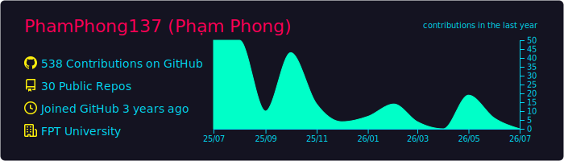
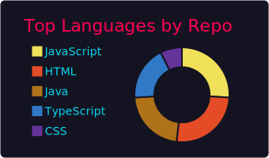
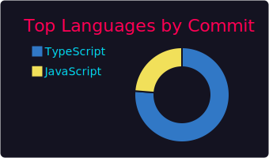
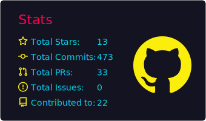
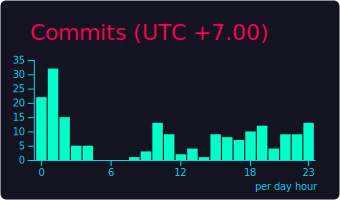

<h1 >Hi 👋, I'm Pham Phong</h1>
<h3 >A passionate DevOps Engineer and monitoring enthusiast from Vietnam</h3>

  

---

  🔭 Currently working on <strong>CI/CD pipelines, infrastructure, and monitoring systems</strong> 
  🌱 Learning more about <strong>Docker, Kubernetes, Prometheus, Grafana, and Terraform</strong> 
  💬 Ask me about <strong>DevOps, monitoring, automation, and system reliability</strong> 
  📫 Reach me at: <a href="mailto:pp072003@gmail.com">pp072003@gmail.com</a>

---

### 🌟 **GitHub Stats**

  

  
  

  
  

---

### 📈 **Activity Graph**

  

---

### 🛠 **Tech Stack & Tools**

  
  
  
  
  
  
  
  
  
  
  
  
  
  
  

---

### 📫 **Connect with Me**

  
  
  
  

